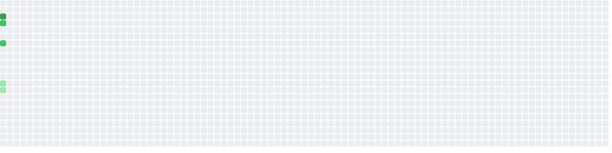

  

<h1 align="center">Hi 👋, I'm Mohamed Yassine</h1>
<h3 align="center">Software engineer & backend / DevOps developer</h3>

  

---

- 🔭 I work mostly on **backend systems** and **Kubernetes infrastructure**
- 🌱 I’m currently deepening my skills in **Kubernetes** and **DevOps / GitOps**
- 👨‍💻 I love learning new technologies and contributing to new projects
- 💬 Ask me about **Java**, **SQL** or **Kubernetes**
- ⚡ Fun fact: **I love playing video games**

## 🛠️ Skills

### Languages

### Backend

### DevOps & Infrastructure

### Tools

### Front-End Development

### Hosting / Deployment

### Design Tools

